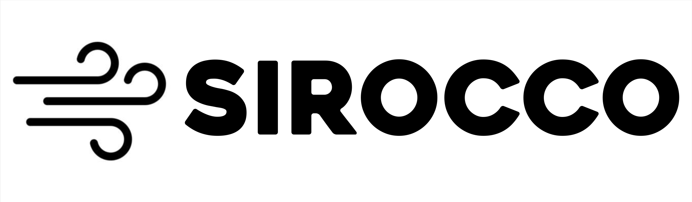

.. sirocco documentation master file, created by
   sphinx-quickstart on Sun Jan 14 18:04:35 2018.
   You can adapt this file completely to your liking, but it should at least
   contain the root `toctree` directive.

####################################################################################
SIROCCO - Simulating Ionization and Radiation in Outflows Created by Compact Objects
####################################################################################



.. image:: https://img.shields.io/badge/arXiv-2410.19908-b31b1b.svg?style=for-the-badge
   :target: https://arxiv.org/abs/2410.19908

.. image:: https://img.shields.io/badge/Github-sirocco-4475A0.svg?style=for-the-badge&logo=github&logoColor=white
   :target: https://github.com/sirocco-rt/sirocco

SIROCCO is a Monte-Carlo radiative transfer code designed to simulate the spectrum of biconical (or spherical)
winds in disk systems.  It was formerly known as Python, and originally written by
`Long and Knigge (2002) <https://ui.adsabs.harvard.edu/abs/2002ApJ...579..725L/abstract>`_ and
was intended for simulating the spectra of winds in cataclysmic variables. Since then, it has
also been used to simulate the spectra of systems ranging from young stellar objects to AGN. 
SIROCCO is named after the `Sirocco wind <https://en.wikipedia.org/wiki/Sirocco>`_, and also 
stands for Simulating Ionization and Radiation in Outflows Created by Compact Objects. 
```sirocco-0.1```, the version of the code in October 2024, is described by `Matthews, Long et al. <https://arxiv.org/abs/2410.19908>`_

The program is written in C and can be compiled on systems runining various flavors of linux, including macOS and the
Windows Subsystem for Linux (WSL). The code is is available on `GitHub <https://github.com/sirocco-rt/sirocco>`_. Issues
regarding the code and suggestions for improvement should be reported there.  We actively encourage others to make use of
the code for their own science.  If anyone has questions about whether the code might be useful for a project, we
encourage you to contact one of the authors of the code.

---------------------------------------
Documentation \& Publications
---------------------------------------

Various documentation exists:

* A :doc:`Quick Guide <quick>` describing how to install and run SIROCCO (in a fairly mechanistic fashion).
* More detailed documentation on this site and in the docs/sphinx/ folder of the repository. 
* A `code release paper <https://arxiv.org/abs/2410.19908>`_, submitted to MNRAS in October 2024
* Various PhD theses that describe the code in more detail: 
    * Higginbottom, N (2014): `Modelling accretion disk winds in quasars <https://eprints.soton.ac.uk/368584/>`_, 
    * Matthews, J. (2016): `Disc Winds Matter: Modelling Accretion And Outflow On All Scales <https://ui.adsabs.harvard.edu/abs/2016PhDT.......348M/abstract>`_, 
    * Mangham, S. (2019): `The reverberation signatures of accretion disk winds in active galactic nuclei <https://eprints.soton.ac.uk/437717/>`_, 
    * Parkinson, E. (2022): `Shining lights, even in death: modelling the optical and ultraviolet emission from tidal disruption events <https://eprints.soton.ac.uk/457482/>`_ . 

For more information on how this page was generated and how to create documentation for SIROCCO,
look at the page for :doc:`documentation on the documentation <meta>`.

`This ADS library <https://ui.adsabs.harvard.edu/public-libraries/dRea2kBFSCmzAji_7yTK9Q>`_ contains a list of publications using SIROCCO to date. 


-------
Authors
-------
The authors of the SIROCCO code and their institutions are:

Knox Long
  Space Telescope Science Institute, 3700 San Martin Drive, Baltimore, MD 21218, USA
  Eureka Scientific, Inc., 2452 Delmer St., Suite 100, Oakland, CA 94602-3017, USA

Christian Knigge
  Department of Physics and Astronomy, University of Southampton, Southampton, SO17 1BJ, UK

Stuart Sim
  School of Mathematics and Physics, Queen's University Belfast, University Road, Belfast, BT7 1NN, UK

Nick Higginbottom
  Department of Physics and Astronomy, University of Southampton, Southampton, SO17 1BJ, UK

James Matthews
  Department of Physics, Astrophysics, University of Oxford, Denys Wilkinson Building, Keble Road, Oxford, OX1 3RH, UK

Sam Mangham
  Department of Physics and Astronomy, University of Southampton, Southampton, SO17 1BJ, UK

Edward Parkinson
  Department of Electronics and Computer Science, University of Southampton, Southampton, SO17 1BJ, UK

Mandy Hewitt
  School of Mathematics and Physics, Queen's University Belfast, University Road, Belfast, BT7 1NN, UK

Nicolas Scepi
  Univ. Grenoble Alpes, CNRS, IPAG, 38000 Grenoble, France

Austen Wallis
  Department of Physics and Astronomy, University of Southampton, Southampton, SO17 1BJ, UK

Amin Mosallanezhad
  Department of Physics and Astronomy, University of Southampton, Southampton, SO17 1BJ, UK

----------------------------------------

.. toctree::
   :titlesonly:
   :glob:
   :hidden:
   :caption: Documentation

   quick
   installation
   running_sirocco
   input
   output
   plotting
   operation
   radiation
   wind_models
   coordinate
   examples
   physics
   atomic
   meta
   developer
   *
