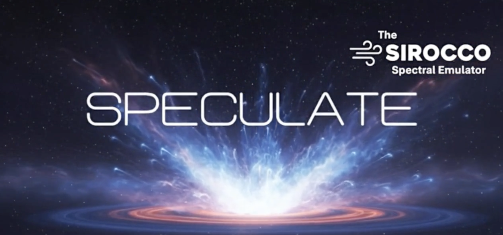

################################
Speculate: Our Sirocco Emulator
################################

Overview
========

`Speculate <https://huggingface.co/spaces/Sirocco-rt/Speculate>`_ is our sythetic spectral library and emulator tool that allows for the rapid *approximate* inference of Sirocco parameters for an observation.

Sirocco is a Monte-Carlo radiative transfer code, and while it is well-suited to forward-modelling
the spectra of accretion disc winds, running it inside a parameter-inference loop is
prohibitively expensive. `Speculate` was built to bridge this gap: it replaces the expensive Sirocco
forward model with a fast surrogate, so that observed spectra can be fit to Sirocco's underlying
outflow parameters in a fraction of the time. The result is *approximate* — the surrogate is only as
good as the grid and the emulator trained on it — but it is fast enough to make MLE and MCMC
inference of Sirocco parameters practical and point the user to the correct region of sirocco 
parameter space for more detailed forward-modelling.

Note: All spectra used for publications **should** be generated by the full Sirocco code, not the surrogate. 

Tools
=====

`Speculate` is distributed as a `marimo` notebook suite. The individual tools are documented in full
on the `Speculate wiki <https://github.com/sirocco-rt/speculate/wiki>`_; at a high level they are:

- **Model Downloader** — fetches Sirocco spectral grids and pre-trained emulator models from HuggingFace.
- **Grid Inspector** — browses raw Sirocco spectra from a grid and can overlay **your** observations.
- **Training Tool** — trains PCA + Gaussian-process emulators on a Sirocco grid.
- **Inference Tool** — fits a trained GP emulator to an observed spectrum via MLE and MCMC.
- **Quick Fit** — trains or loads a lightweight neural-network or grid interpolation surrogate and fits by :math:`\chi^2` for fast quick-look results.
- **Benchmark Suite** — runs Tier 1 / 2 / 3 reports characterising emulator quality (grid reconstruction, parameter recovery, and observational spectra).

A reduced subset of these tools (Grid Inspector and Quick Fit) is also available **online** through the hosted
HuggingFace Space, while the full workflow — including training and MCMC inference — requires a
local install.

Synthetic Libraries
===================

The Sirocco grids and pre-trained emulators that `Speculate` consumes are hosted under the
`Sirocco-rt HuggingFace organisation <https://huggingface.co/Sirocco-rt>`_. The currently published
synthetic libraries are:

**Full Grids:**

- `speculate_cv_bl_grid_v87f <https://huggingface.co/datasets/Sirocco-rt/speculate_cv_bl_grid_v87f>`_ — CV disc-wind grid with boundary layer emission.
- `speculate_cv_no-bl_grid_v87f <https://huggingface.co/datasets/Sirocco-rt/speculate_cv_no-bl_grid_v87f>`_ — CV disc-wind grid without boundary layer emission.
- `speculate_agn_grid_v1.3 <https://huggingface.co/datasets/Sirocco-rt/speculate_agn_grid_v1.3>`_ — AGN disc-wind grid.

**Test Grids:**

- `speculate_cv_bl_testgrid_v87f <https://huggingface.co/datasets/Sirocco-rt/speculate_cv_bl_testgrid_v87f>`_ — held-out CV (with BL) test grid for benchmarking.
- `speculate_cv_no-bl_testgrid_v87f <https://huggingface.co/datasets/Sirocco-rt/speculate_cv_no-bl_testgrid_v87f>`_ — held-out CV (no BL) test grid for benchmarking.
- `speculate_agn_testgrid_v1.3 <https://huggingface.co/datasets/Sirocco-rt/speculate_agn_testgrid_v1.3>`_ — held-out AGN disc-wind test grid for benchmarking.

Pre-trained emulators are published alongside these grids as the
`speculate_cv_emulators <https://huggingface.co/Sirocco-rt/speculate_cv_emulators>`_ and `speculate_agn_emulators <https://huggingface.co/Sirocco-rt/speculate_agn_emulators>`_ model
collection.

Further Reading
===============

- **Speculate documentation** can be found following: https://github.com/sirocco-rt/speculate/wiki
- **Speculate Online** can be found at our organisation's huggingface space: https://huggingface.co/spaces/Sirocco-rt/Speculate
- **Speculate's Github repository** for local install can be found at: https://github.com/sirocco-rt/speculate
- **Speculate's Sirocco Sythetic Library** can be found in our our organisation's huggingface datasets: https://huggingface.co/Sirocco-rt

